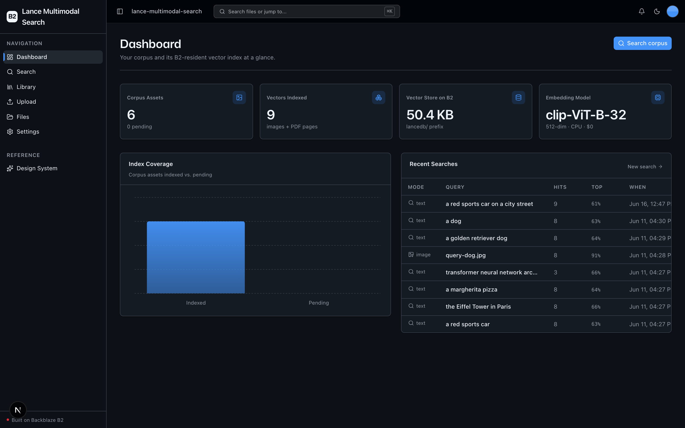
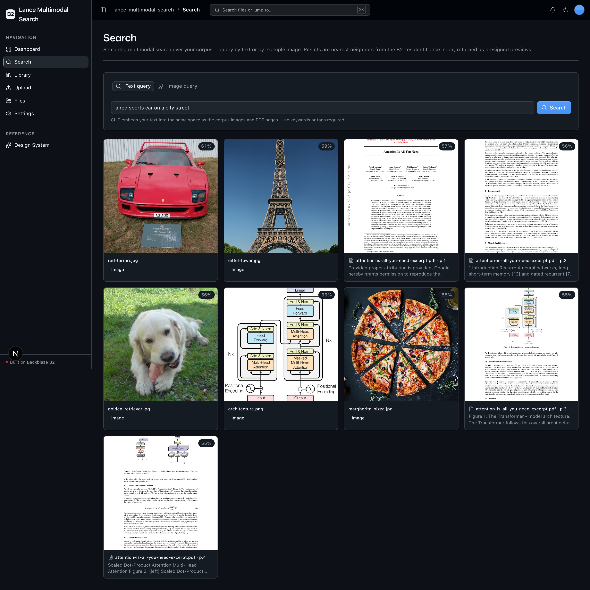
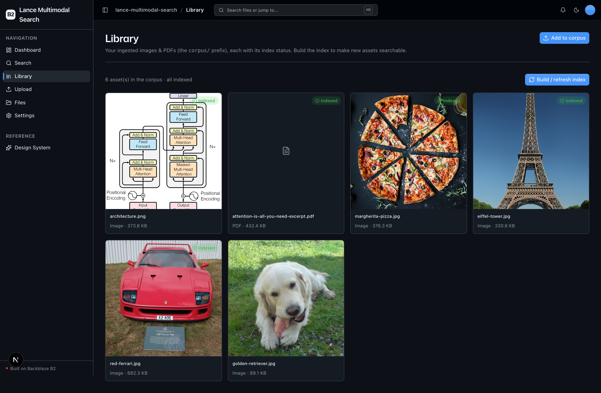
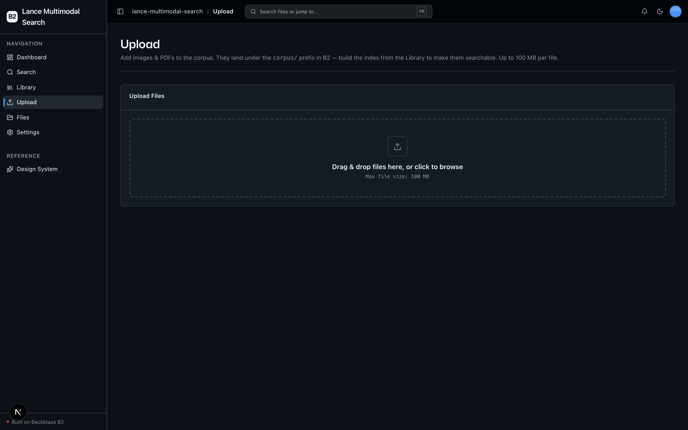

<!-- last_verified: 2026-06-11 -->
# Lance Multimodal Search

Semantic, multimodal search over an image-and-PDF corpus — with **no vector-database server to run**. The entire vector store (source assets, embeddings, columnar metadata, and the ANN index) lives directly on **[Backblaze B2](https://www.backblaze.com/sign-up/ai-cloud-storage?utm_source=github&utm_medium=referral&utm_campaign=ai_artifacts&utm_content=b2ai-lance-multimodal-search)** via [LanceDB](https://lancedb.com). Embeddings are computed **locally on CPU** with an open-source CLIP model, so it **runs on your B2 credentials alone — no second API key, ~$0 per run** (B2 storage only).

Search the corpus by **text** ("a red bicycle on a beach") or by **example image** (drop in a photo, get visually similar assets back). Results come back as presigned B2 preview URLs, ranked by similarity. PDFs are made searchable too: each page is rendered to an image and embedded into the same space, so a hit can be a standalone image *or* a document page.

**This is the headline: B2 is the AI storage substrate, not a downstream sink.** LanceDB reads and writes the Lance format directly against B2's S3-compatible API — the index *is* the bucket.

## What it looks like

**Dashboard** — corpus and B2-resident vector-store metrics, an index-coverage chart, and a recent-searches table.



**Search** — text or example-image query against the Lance index, returning a nearest-neighbor gallery with similarity scores and presigned B2 previews.



**Library** — the `corpus/` prefix as a grid of ingested images and PDFs, each tagged with its index status and a build/refresh action.



**Upload** — drag-and-drop ingest of images and PDFs into the `corpus/` prefix on B2.



**What you get out of the box:**
- Text **and** image query over a media corpus (CLIP `clip-ViT-B-32`, 512-dim, shared image+text space)
- PDF document search — pages rendered with `pymupdf`, embedded as images, one Lance row per page
- A B2-resident Lance table + ANN index — no Pinecone, Weaviate, or Postgres+pgvector to stand up
- Corpus Library with per-asset index status and one-click "build / refresh index"
- Full-stack dashboard UI (Next.js 16 + React 19 + Tailwind v4 + shadcn/ui), file upload, and a full-bucket file browser
- FastAPI backend with strict layered architecture, structural tests, JSON logging, `/health`, `/metrics`

## Who it's for

Design teams, ML engineers, and data scientists who want semantic / multimodal search over a media corpus without operating a vector database.

## How it works

```
Upload (images & PDFs)  ─▶  corpus/   (B2)
                                │
                       Build index │ list corpus → embed
                                ▼
   images  ─────────────────────────────▶  CLIP image embedding ─┐
   PDFs → render pages (pymupdf) → derived/pages/*.png (B2) ──────┘
                                                                  ▼
                                            Lance table + ANN index  ←──  s3://<bucket>/lancedb/
                                                                  │
   Search (text or image) → CLIP embed query → kNN over Lance ───┘ → presigned B2 previews
```

- **Embeddings are local.** `sentence-transformers` loads `clip-ViT-B-32` on CPU. The first run downloads the model weights from HuggingFace once (no key); after that it's cached on disk.
- **The vector store is the bucket.** LanceDB's internal S3 client reads/writes Lance manifests, data fragments, and the ANN index under the `lancedb/` prefix on B2. There is no separate database process.
- **PDFs are first-class.** Each page (capped at `MAX_PAGES_PER_DOC`) is rendered to a PNG, stored under `derived/pages/`, and embedded as an image. A short extracted-text snippet is kept as row metadata for display.

## Quick Start

You need: Node.js >= 20, pnpm >= 9, Python >= 3.11, and a free **[Backblaze B2 account](https://www.backblaze.com/sign-up/ai-cloud-storage?utm_source=github&utm_medium=referral&utm_campaign=ai_artifacts&utm_content=b2ai-lance-multimodal-search)**. No other API keys.

```bash
git clone https://github.com/backblaze-b2-samples/lance-multimodal-search.git
cd lance-multimodal-search
```

**1. Install dependencies**

```bash
pnpm install
```

**2. Set up the backend**

```bash
cd services/api
python -m venv .venv && source .venv/bin/activate
pip install -r requirements.txt
cd ../..
```

> The backend pulls in `sentence-transformers` (CPU `torch`), `lancedb`, `pyarrow`, and `pymupdf`. The CLIP model weights download lazily on the first search/index call — a one-time, key-free fetch.

**3. Add your B2 credentials**

```bash
cp .env.example .env
```

Open `.env` and, from the [Backblaze B2 dashboard](https://secure.backblaze.com/b2_buckets.htm?utm_source=github&utm_medium=referral&utm_campaign=ai_artifacts&utm_content=b2ai-lance-multimodal-search):

1. **Create a bucket.** Paste each value into `.env`:
   - **Bucket Unique Name** → `B2_BUCKET_NAME`
   - **Region** → `B2_REGION` (e.g. `us-west-004`) — the app derives the S3-compatible endpoint from this.
2. **Create an application key** with `Read and Write` permission. Paste:
   - **keyID** → `B2_APPLICATION_KEY_ID`
   - **applicationKey** → `B2_APPLICATION_KEY` *(only shown once)*

> Walkthroughs: [creating a bucket](https://www.backblaze.com/docs/cloud-storage-create-and-manage-buckets?utm_source=github&utm_medium=referral&utm_campaign=ai_artifacts&utm_content=b2ai-lance-multimodal-search) and [creating app keys](https://www.backblaze.com/docs/cloud-storage-create-and-manage-app-keys?utm_source=github&utm_medium=referral&utm_campaign=ai_artifacts&utm_content=b2ai-lance-multimodal-search).

**4. Run it**

```bash
pnpm dev
```

Frontend at `localhost:3000`, API at `localhost:8000`. Then:

1. Go to **Upload** and add a few images and/or PDFs (they land under `corpus/`).
2. Go to **Library**, confirm they show as *Pending*, and click **Build / refresh index** (first run downloads the CLIP model).
3. Go to **Search** and query by text or drop in an image.

`pnpm dev` runs `pnpm doctor` first — a preflight check for the common setup gotchas (Node/Python version, missing venv, missing or placeholder `.env`, busy ports).

## Core Features

- [Semantic & Multimodal Search](docs/features/semantic-search.md) — text or image query; CLIP shared space; ANN over the B2-resident table
- [Document Page Indexing](docs/features/document-indexing.md) — PDFs rendered page-by-page, embedded as images, one row per page
- [Corpus Library](docs/features/corpus-library.md) — scoped explorer of ingested images & PDFs with index status + build action
- [Object-Storage-Native Vector Store](docs/features/vector-store.md) — the Lance table + ANN index on B2, storage options, the single-writer caveat, seed-row create
- [Corpus Ingest (Upload)](docs/features/file-upload.md) — drag-and-drop images & PDFs into `corpus/`
- [File Browser](docs/features/file-browser.md) — full-bucket browse / preview / download / delete
- [Metadata Extraction](docs/features/metadata-extraction.md) — image dimensions, EXIF, PDF info, checksums
- [Dashboard](docs/features/dashboard.md) — corpus & index metrics, index coverage chart, recent searches
- [Design System](docs/design-system.md) — tokens, primitives, loader, error/empty states. Live preview at `/design`.

## B2 Surface (S3-compatible API only)

All B2 access uses the **S3-compatible API** — not the native B2 API.

- **boto3 client** (`services/api/app/repo/b2_client.py`, user agent `lance-multimodal-search (backblaze-b2-samples)`, `region_name=B2_REGION`): `put_object`, `list_objects_v2`, `get_object`, `head_object`, `delete_object`, `generate_presigned_url`, `head_bucket`.
- **LanceDB object_store** (Lance's internal S3 client, `lancedb/` prefix, same user agent via storage options): GET/PUT/LIST/DELETE + multipart for the Lance manifest, data fragments, and ANN index.

LanceDB also sets `aws_s3_allow_unsafe_rename=true` because B2 doesn't support the conditional PUT LanceDB uses for commits; the consequence is single-writer indexing. See [ARCHITECTURE.md](ARCHITECTURE.md) and [docs/RELIABILITY.md](docs/RELIABILITY.md).

## Tech Stack

- TypeScript, Next.js 16, React 19, Tailwind v4, shadcn/ui, Recharts, TanStack Query
- Python 3.11+, FastAPI, boto3, Pydantic v2
- **LanceDB** (`lancedb` + `pyarrow`) — vector store on B2
- **CLIP** via `sentence-transformers` (`clip-ViT-B-32`, 512-dim, CPU, no API key)
- **pymupdf** — PDF page rendering (bundles its own libs; no poppler/system deps)
- Backblaze B2 (S3-compatible object storage) — the vector store *is* the bucket
- pnpm workspaces (monorepo)

## Commands

| Command | What it does |
|---------|-------------|
| `pnpm dev` | Start frontend + backend |
| `pnpm dev:web` | Frontend only |
| `pnpm dev:api` | Backend only |
| `pnpm build` | Build frontend |
| `pnpm lint` | Lint frontend |
| `pnpm lint:api` | Lint backend (ruff) |
| `pnpm test:api` | Run backend tests |
| `pnpm check:structure` | Verify layering rules |
| `pnpm test:e2e` | Playwright e2e tests (run `pnpm --filter @lance-multimodal-search/web exec playwright install chromium` once first) |

## Documentation Map

| Doc | Purpose |
|-----|---------|
| [AGENTS.md](AGENTS.md) | Agent table of contents — start here |
| [ARCHITECTURE.md](ARCHITECTURE.md) | System layout, layering, data flows, the B2↔LanceDB mechanism |
| [docs/features/](docs/features/) | Feature docs |
| [docs/app-workflows.md](docs/app-workflows.md) | User journeys (ingest → index → search) |
| [docs/dev-workflows.md](docs/dev-workflows.md) | Engineering workflows and testing |
| [docs/SECURITY.md](docs/SECURITY.md) | Security principles |
| [docs/RELIABILITY.md](docs/RELIABILITY.md) | Reliability expectations (single-writer, seed-row, model download) |
| [docs/exec-plans/](docs/exec-plans/) | Execution plans and tech debt tracker |

## License

MIT License — see [LICENSE](LICENSE) for details.

## Claude Agent B2 Skill

Manage Backblaze B2 from your terminal using natural language (list/search, audits, stale or large file detection, security checks, safe cleanup).

Repo: [https://github.com/backblaze-b2-samples/claude-skill-b2-cloud-storage](https://github.com/backblaze-b2-samples/claude-skill-b2-cloud-storage)
